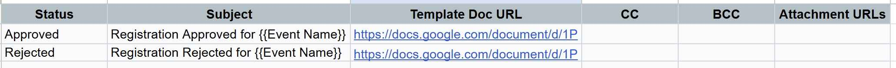

# GSMailer


GSMailer is a production-ready Google Apps Script library that automates
event-based email workflows directly from Google Sheets using Google Docs templates.

It is designed for event organisers, NGOs, and teams who want to easily and reliably send personalised emails from Sheets.

---

## Features

- Send automated emails based on row status in Google Sheets
- Use Google Docs as HTML templates with dynamic variables
- Supports batch sending and dry run mode
- Optional registration number generation
- Optional Email attachments via Google Drive URL
- Event context variables for common info (like event name, date)
- Preview emails before sending
- Supports CC and BCC recipients

---

## Installation

1. Open your Google Sheet and 
2. Go to Extensions → Apps Script
3. Add GSMailer as a library:
   - Click Libraries (+)
   - Library ID: 1PUNerdrrA-ZaUAegdlgkMvbmyJW_yLRrIHEg_wy-h69HE11Fd0mU_SeQ
   - Identifier: GSMailer
   - Version: 12  (or select latest)
   - Click Add
4. Add the code below to the code editor

```javascript
function onOpen() {
  GSMailer.onOpen();
}

function initialSetup() {
  GSMailer.initialSetup();
}

function validateSetup() {
  GSMailer.validateSetup();
}

function sendEmailsLive() {
  GSMailer.sendEmailsLive();
}

function sendEmailsDryRun() {
  GSMailer.sendEmailsDryRun();
}

function previewSelectedRow() {
  GSMailer.previewSelectedRow();
}

function generateRegistrationNumbers() {
  GSMailer.generateRegistrationNumbers();
}

function showAboutDialog() {
  GSMailer.showAboutDialog();
}
```

5. Save, run onOpen() and Grant Permissions.
6. In Google Sheet. You will see a new menu: 📨 GSMailer.
7. Important: Go to GSMailer → Admin / Setup → **Initial Setup** 
8. Configure your SETTINGS, EMAIL_RULES, EVENT_CONTEXT as needed.
9. Your Main Data sheet needs 3 extra columns for: 'Email Sent',	'Last Email At' and 'Email Error'. If needed, you can rename them in Settings.
---


## Email Templates (Google Docs)

GSMailer uses Google Docs as the source for email content.
This allows design-rich, formatted HTML emails without writing any code.

**How It Works**
1. You create a Google Doc as your email template
2. Insert placeholders using {{VariableName}}
3. GSMailer replaces placeholders with values from: Your main data sheet (row values) and SETTINGS sheet (EVENT_CONTEXT)
4. The document is converted to HTML and sent via Gmail

**Example**

```
Dear {{Name}},

Thank you for registering for {{EventName}}.

Date: {{EventDate}}  
Venue: {{EventVenue}}

We look forward to seeing you!

Warm regards,  
{{OrganizerName}}
```

---
## Settings Sheet

This sheet allows you to configure settings and event details. It will be created by the Initial setup button from the menu. 


---

## Email Rules Sheet (EMAIL_RULES)
This sheet allows you to define multiple rules for sending emails. It will be created by the Initial setup button from the menu.


---


## Changelog

v2.0.3
- Batch email sending
- HTML template support
- Registration number generation
- Dry run and preview mode

---

## License

MIT License © 2026 Rohit Verma
